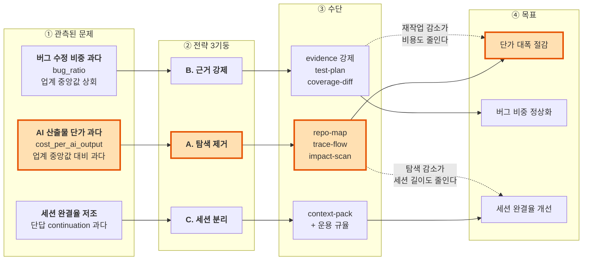
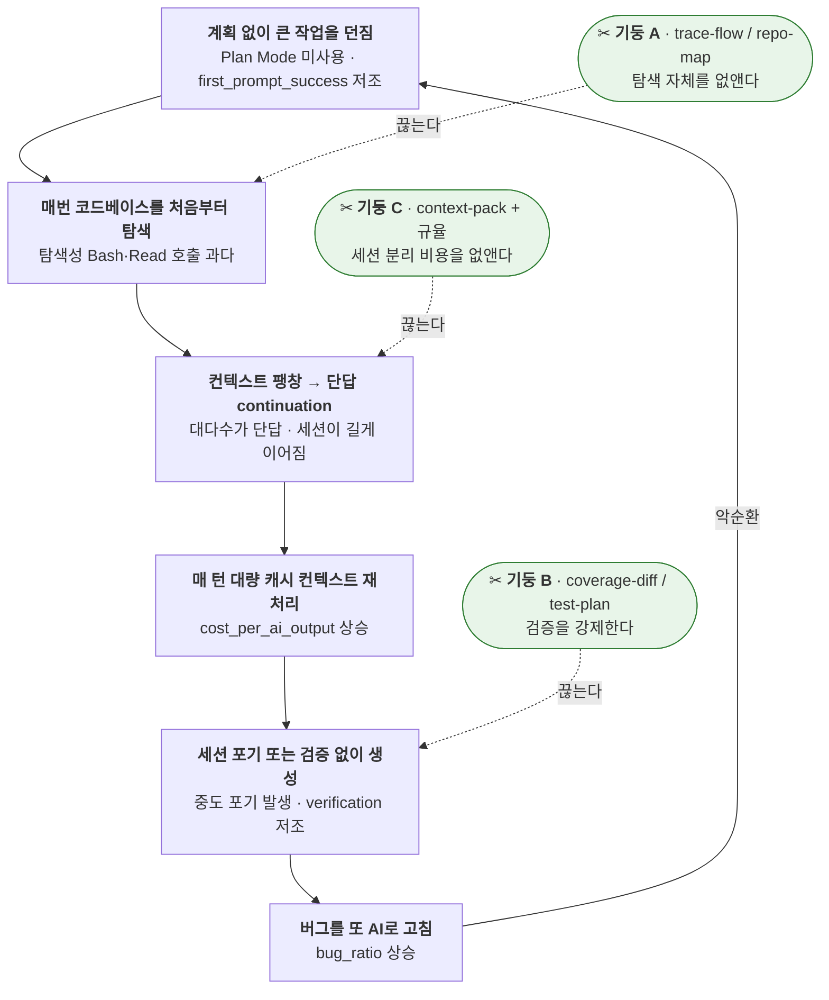
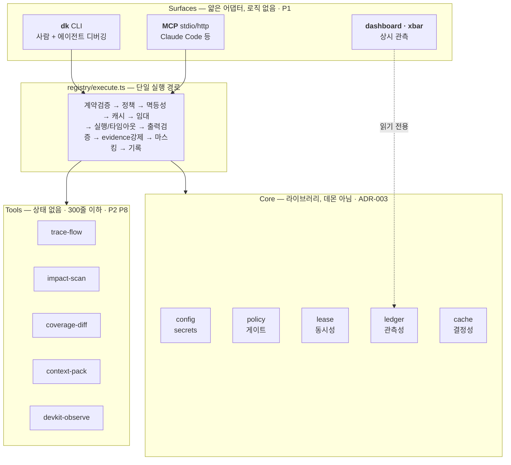
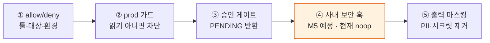
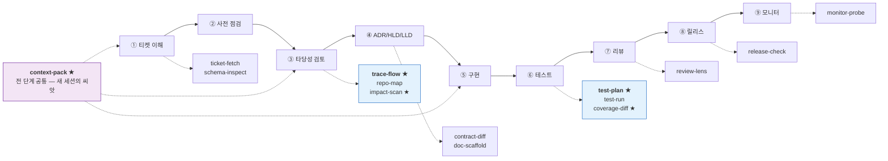
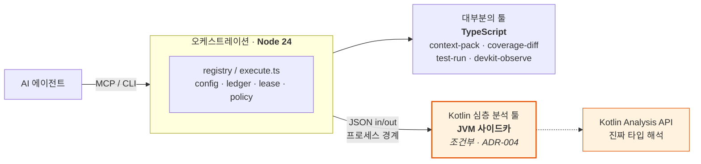
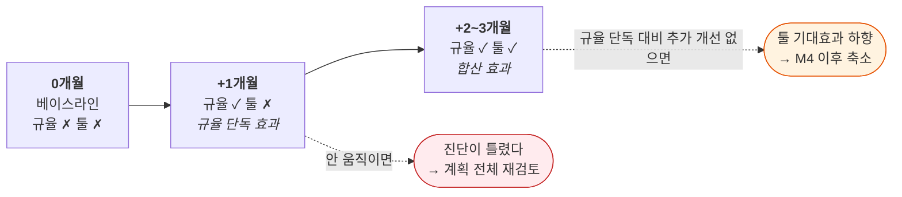

# devkit — 1인 개발 사이클 보조 툴체인

> 상태: Draft v3 · 대상 독자: 저장소 소유자 + AI 에이전트
> v3: 전략 우선 구조로 재편, 문제↔해결 추적 다이어그램 추가,
> **ADR-001 언어 결정 재검토** (JVM 기동 비용 측정 → 초안 근거 정정, 하이브리드로 전환) + ADR-004 신설
> 읽는 법: **전략**만 읽어도 의사결정이 가능하다. Part 1은 근거, Part 2는 설계, Part 3은 실행이다.

---

# 전략

## 한 줄

> **AI 에이전트의 "탐색"을 "캐시된 사실"로 대체하고, 그 사실의 출처를 산출물에 남긴다.**
> 전자가 비용을, 후자가 품질을 움직인다.

## 전략 3기둥

| 기둥 | 선언 | 겨냥하는 문제 |
|---|---|---|
| **A. 탐색 제거** | 에이전트가 코드베이스를 매번 훑지 않는다. 한 번 분석하고 커밋 SHA로 캐시한다 | AI 산출물 단가 과다 |
| **B. 근거 강제** | 근거 없는 결과는 툴이 반환하지 못한다. 스키마 레벨에서 막는다 | 버그 수정 비중 과다 |
| **C. 세션 분리를 공짜로** | 새 세션 시작 비용을 0에 가깝게 만들어 긴 세션을 끌 이유를 없앤다 | 세션 완결율 저조 |

## 전체 그림



**이 그림이 전부다.** 아래 모든 내용은 이 4단 연결의 근거이거나 구현 방법이다.
새 툴을 만들 때는 **"이 툴이 ①의 어느 문제에서 출발해 ④의 어느 지표로 가는가"**를
먼저 답할 수 있어야 한다. 답을 못 하면 만들지 않는다.

## 지금 상태

| 단계 | 상태 |
|---|---|
| **M0** 코어 런타임 · CLI · MCP · 관측성 | ✅ **완료** (2026-08-23, 테스트 22/22) — §14.1 |
| **M1** `repo-map` · `trace-flow` · `context-pack` v0 | 다음 |
| M2~M6 | §14 |
| **운용 규율** (툴 아님) | ⏩ **오늘부터 적용** — §5 |

---

# Part 1. 왜 (Why)

## 1. 문제 — 관측된 패턴

> AI 사용 분석 리포트 3개월치를 검토한 결과.
> 초안의 "as-is 이해가 얕아서"라는 **추측을 관측 데이터로 대체**했다.
>
> *(이 저장소는 공개용이라 절대 수치는 싣지 않는다. 판단에 필요한 건 방향과 순위지 숫자가 아니다.)*

**A. 비용 대비 산출 — 가장 취약**

- `cost_per_ai_output`(AI 산출물 1건당 비용)이 **업계 중앙값을 크게 상회**
- `output_per_dollar` 역량 점수가 **전체 역량 중 최하**
- 월간 토큰 사용량 자체가 큼 — 그런데 **대부분이 새로 읽는 내용이 아니라 재처리되는 캐시 컨텍스트**

**B. 세션 효율**

- `session_completion_rate`(목표를 완수하고 끝난 세션 비율)가 **낮음**
- `first_prompt_success`(첫 프롬프트로 의도한 결과를 얻는 비율)도 **낮음**
- 중도 포기 세션이 매달 발생

**C. 산출물 구성**

- `bug_ratio`(버그 수정이 산출물에서 차지하는 비중)가 **3개월 연속 급상승**, 업계 중앙값을 크게 상회
- 그만큼 `innovation_ratio`(신규 기능 개발 비중)가 **밀려남**
- `verification`(사전/사후 검증 역량) **저조**
- `agent_parallelization`(에이전트 병렬 활용) **저조**

**D. 프롬프트·도구 사용 패턴 — 근본 원인이 여기 있다**

- 프롬프트의 **대다수가 단순 이어가기(continuation)** — "계속해줘", "다시 해봐" 류
- continuation의 입력 토큰은 몇 개뿐인데, **매 턴 대량의 캐시 컨텍스트가 재처리**된다
- 세션이 수십 턴씩 길게 이어짐
- 도구 호출은 **탐색성 Bash/Read가 압도적**, Plan Mode는 사실상 미사용

## 2. 악순환 — 문제가 서로를 먹인다



**사슬의 시작점은 B(탐색)다.** 탐색성 Bash/Read 호출이 압도적이라는 건 에이전트가 코드베이스를 매번 처음부터
훑고 있다는 뜻이고, 그 결과가 컨텍스트를 부풀려 나머지 전부를 만든다.
**그래서 기둥 A가 1순위다.**

## 3. 초안 가설의 정정

| 초안 가설 | 판정 | 근거 |
|---|---|---|
| as-is 이해가 얕은 채로 구현 → 버그 | **맞음** | bug_ratio 상승, verification 저조 |
| AI 산출물에 근거가 안 남아 검증 불가 | **부분적 맞음** | 직접 지표는 없으나 verification 점수와 정합 |
| AI 사용량이 많은 게 문제 | **틀림** | 사용량이 아니라 **단가**가 문제. 토큰 대부분이 재처리된 캐시 컨텍스트 |
| *(누락했던 축)* | **최대 문제** | **세션 운용 패턴.** 단답 continuation 과다, 세션 완결율 저조 |

## 4. 툴로 푸는 것 vs 습관으로 푸는 것

정직하게 나눈다. **devkit이 단답 continuation을 직접 없애주지는 않는다.**

| 문제 | 성격 | devkit의 역할 |
|---|---|---|
| 매번 처음부터 코드베이스 탐색 | **툴** | `repo-map`/`trace-flow`가 캐시된 1회 호출로 대체 ← 최대 레버 |
| 세션 분리를 못 함 | **툴이 습관을 가능하게** | `context-pack`이 새 세션 시작 비용을 0으로 |
| bug_ratio 상승, verification 저조 | **툴** | `test-plan`/`coverage-diff`가 검증 강제 |
| `agent_parallelization` 저조 | **툴** | §11 동시성 모델 + `devkit-observe` |
| Plan Mode 미사용 | **습관** | 툴이 못 고친다 → §5 |
| 단답 continuation | **습관** | 툴이 못 고친다 → §5 (단, `context-pack`이 대안 비용을 낮춤) |

## 5. 운용 규율 — 툴 아님, 오늘부터 적용

툴은 M1이 되어야 나온다. 아래는 **지금 바로** 적용한다. 지표 개선의 상당 부분이 여기서 나온다.

1. **세션 분리** — 15~20턴 넘으면 커밋하고 새 세션. `context-pack` 전까지는 수동 요약으로.
2. **테스트 우선 프롬프팅** — 버그 수정은 "실패 재현 테스트 작성 → 최소 수정 → 테스트 실행 보고" 3단계를 프롬프트에 명시.
3. **계획 후 실행** — 복잡한 작업은 Plan Mode로 파일 목록·설계안·테스트 계획을 먼저 합의.
4. **continuation 금지** — "계속해줘" 대신 매번 **범위와 대상 파일을 명시**한다.

> 규율 1~4를 **devkit 개발 자체에 먼저 적용한다.** 다음 달 리포트 지표가 그 검증이다(§15.3).

## 6. 개인 병목과 지표의 일치

주관적 체감 두 가지가 실측과 같은 곳을 가리킨다 — **그래서 우선순위를 바꾸지 않는다.**

| 체감 병목 | 대응 지표 |
|---|---|
| 기존 코드 조사가 오래 걸린다 | 탐색성 Bash/Read 호출 압도적 |
| 구현 후 테스트가 어렵다 | verification 저조 · bug_ratio 상승 |

## 7. 대상 환경 (실측)

```
OS      : macOS Darwin 25.3.0, Apple Silicon
Node    : v24.13.0        ← node:sqlite 내장 + TS 직접 실행 (빌드 단계 0)
Java    : OpenJDK 25      ← JVM 기동 20ms, Kotlin PSI 로드 100ms (실측, ADR-001)
Python  : 시스템 3.9.6뿐, uv 없음  → venv 마찰 (배제 사유는 이것 하나가 아니다, ADR-001)
기타     : docker · gh · jq · rg 있음 / mysql CLI 없음 → M5에서 docker 경유
```

주요 저장소: Kotlin + Spring Boot + Gradle KTS 멀티모듈(`my-service`, `batch-service`),
Next.js + TS + vitest(`web-app`).

---

# Part 2. 어떻게 (How)

## 8. 설계 원칙 — 각각 어느 문제에 대응하는가

| # | 원칙 | 대응 |
|---|---|---|
| **P11** | **툴 1회 호출이 Bash/Read 탐색 N회를 대체해야 한다** | 기둥 A. 대체 못 하는 툴은 만들 이유가 없다 |
| **P3** | **출력에 `evidence` 필수** — 없으면 스키마 단계에서 실패 | 기둥 B |
| **P12** | **툴 출력이 그대로 새 세션의 씨앗이 될 수 있어야 한다** | 기둥 C |
| **P4** | 출력은 요약 우선 + 커서 페이징, 기본 4KB 이하 | 기둥 A·C (컨텍스트 = 비용) |
| **P6** | 결정적 — `(input, commitSha)` 같으면 출력 같다 | 기둥 A (캐시의 전제) |
| **P9** | 모르면 모른다고 반환 — `confidence`, `unresolved[]` | 기둥 B (조용히 틀리는 것 방지) |
| P1 | CLI 우선, MCP는 얇은 어댑터 | 제약 2 (에이전트 디버깅 루프) |
| P2 | 툴은 stateless, 상태는 전부 외부 | 요구사항 3 (동시성) |
| P5 | 에러는 구조화 + 수정 방법 동봉 | 제약 2 |
| P7 | 네이티브 의존성 0 | 제약 2 (빌드 지옥 방지) |
| P8 | 툴 하나 = 디렉토리 하나 = 300줄 이하 | 제약 2 (한 컨텍스트에 담긴다) |
| **P10** | **3일 내 실사용 안 되면 삭제** | 최대 리스크(§16-1) 방어 |

## 9. 아키텍처



**핵심: `execute.ts`가 유일한 실행 경로다.** CLI든 MCP든 전부 여기로 모인다.
surface에 로직을 두지 않으므로 MCP 스펙이 바뀌어도 어댑터만 고치면 된다.

**데몬을 두지 않는다.** 각 호출은 짧은 수명의 프로세스이고, 공유 상태는 SQLite(WAL)에만 있다.
1인 환경에서 데몬 생명주기 관리 비용이 이득보다 크다.

## 10. 툴 계약 — 가장 중요한 추상화

모든 툴은 `manifest.json`(계약) + `index.ts`(구현) 한 쌍이다.

```jsonc
// manifest.json
{
  "name": "trace-flow",
  "version": "1.2.0",
  "whenToUse": "티켓의 as-is 파악, 사이드이펙트 조사, HLD 작성 전",  // LLM이 읽는 필드
  "inputSchema":  { /* JSON Schema */ },
  "outputSchema": { /* JSON Schema */ },
  "sideEffects": "read",                    // read | write | external
  "concurrency": { "mode": "safe", "resourceKey": null },   // exclusive면 자원 임대
  "determinism": "by-commit",               // pure | by-commit | nondeterministic
  "timeoutSec": 120,
  "requiresApproval": false
}
```

**출력 봉투 — 모든 툴 공통**

```jsonc
{
  "ok": true, "toolVersion": "1.2.0", "runId": "01J9...",
  "confidence": 0.86,                    // P9 — 정적 분석이면 정직하게
  "data": { /* outputSchema */ },

  "evidence": [                          // ★ P3 — 비면 EVIDENCE_REQUIRED로 실패한다
    { "kind": "code", "path": "...PaymentController.kt", "line": 42,
      "sha": "a3f1c9d", "excerpt": "@PostMapping(\"/v1/payments\")" }
  ],
  "unresolved": [                        // ★ P9 — "여긴 직접 봐라" 신호
    { "reason": "dynamic-dispatch", "at": "PaymentPort.process", "hint": "구현체 3개 후보" }
  ],
  "nextActions": [                       // 에이전트 오케스트레이션 유도
    { "tool": "impact-scan", "input": {...}, "why": "이 흐름이 건드리는 테이블 확인" }
  ],
  "truncated": { "hasMore": true, "cursor": "..." },   // P4
  "timings": { "totalMs": 1840, "cacheHit": false }
}
```

**실패 시 — `source`가 제약 2의 핵심이다**

```jsonc
{ "ok": false, "error": {
  "code": "REPO_INDEX_STALE",
  "message": "인덱스가 커밋 a3f1c9d 기준인데 워킹트리는 9b2e77f 입니다",
  "hint": "인덱스를 재생성하세요",
  "retryable": true,
  "fixCommand": "dk run repo-map --repo my-service --refresh",
  "source": { "file": "tools/trace-flow/index.ts", "line": 118 }   // ← 여기로 바로 간다
}}
```

에이전트가 스택트레이스를 뒤지는 게 아니라 **출력에 적힌 파일:라인으로 바로 간다.**

## 11. 요구사항 대응

### 11.1 동시성 (요구사항 3)

| 자원 | 대응 |
|---|---|
| 순수 읽기 툴 | 무제한 병렬 |
| Git 워킹트리 | **에이전트별 `git worktree`** — 공유하지 않는다 |
| 빌드/테스트 (Gradle) | 워크트리별 `GRADLE_USER_HOME` + `exclusive` 임대(동시 2개 상한) |
| 코드 인덱스 | WAL + 단일 라이터. 인덱싱은 `exclusive`, 조회는 `safe` |
| 외부 API | SQLite 토큰버킷을 시스템 단위 공유 |

**임대(lease) 설계 — 3가지 결정**

1. **원자적 CAS** — `INSERT ... ON CONFLICT DO UPDATE WHERE expires_at < now`.
   SELECT 후 INSERT 하는 경합 구간이 없다.
2. **TTL 10분 + 30초 하트비트** — 에이전트가 죽어도 자동 회수. **GC 프로세스가 필요 없다.**
3. **자원 키 사전순 정렬 획득** — 다중 획득 시 순서가 전역 고정되므로 **데드락이 생길 수 없다.**

> 검증됨: 별도 프로세스 8개가 같은 키를 동시에 경합 → 정확히 1개만 획득 (§14.1)

**멱등성**: 쓰기 툴은 `idempotencyKey`를 받고 ledger에 `(tool, key)` 유니크 인덱스를 건다.
에이전트 재시도 루프에 대비한다.

### 11.2 설정·시크릿·보안 게이트 (요구사항 4)

**설정 5계층 병합**: manifest 기본값 → `~/.devkit/config.toml` → 프로파일 →
`<repo>/.devkit/config.toml` → `DEVKIT_*` 환경변수 → 호출 시 입력

**시크릿 3원칙**
1. 파일에 평문 금지. `keychain://<service>/<account>` **참조만** 저장
2. 해석된 값은 자식 프로세스 env로만 전달
3. ledger/로그/에러 기록 직전 `redact()`로 한 번 더 거른다 (이중 방어)

**정책 게이트 5단계**



> ⚠️ **④는 사내 정책 확인 전까지 인터페이스만 두고 noop이다.**
> 사내 시스템(Jira/DB/로그) 접근 툴 자체를 M5 이후로 미뤘으므로 지금 비어 있어도 위험하지 않다.
> **이 순서는 의도적이다 — 정책 확인 대기로 전체 계획이 멈추지 않게 하기 위함.**

### 11.3 관측성 (요구사항 5)

**기록**: JSONL(`~/.devkit/runs/YYYY-MM-DD.jsonl`)이 진실 원천, SQLite는 조회용 파생 인덱스.
필드명은 OpenTelemetry 호환(`traceId`/`spanId`)이라 나중에 콜렉터로 내보낼 때 재작업이 없다.
**입력 원문은 저장하지 않고 해시만** 남긴다(시크릿·PII 보호). 필요하면 `--record-input` 옵트인.

| 대상 | 수단 |
|---|---|
| 사람 · 터미널 | `dk ps` · `dk tail -f` · `dk stats` · `dk runs` |
| 사람 · 상시 | **xbar 메뉴바** — 실행 중 에이전트 수 / 최근 실패 |
| **에이전트** | **`devkit-observe` 툴** — 자기 이력, 타 에이전트 점유 자원, 실패 패턴 |

`devkit-observe`가 요구사항 5의 절반을 담당한다. 이게 있으면 에이전트가
*"A2가 gradle 락을 잡았으니 나는 정적 분석 먼저"* 같은 판단을 스스로 한다.

### 11.4 에이전트가 툴을 고칠 수 있게 (제약 2)

문서가 아니라 **구조로 보장**한다.

| 장치 | 내용 |
|---|---|
| 네이티브 의존성 0 | `node:sqlite` 내장, `web-tree-sitter` WASM → `npm i` 실패로 막히지 않는다 |
| 빌드 단계 0 | Node 24가 `.ts`를 직접 실행. 고치면 바로 반영 |
| 툴 = 300줄 1파일 | 한 컨텍스트에 담아 수정 |
| `error.source` | 실패 지점을 출력이 직접 알려줌 |
| 골든 픽스처 | `dk test <tool>` 5초 내 완료 |
| 계약 테스트 자동 생성 | manifest에서 생성 → 잘못 고치면 즉시 실패 |
| `dk run --explain` | 실행 없이 설정·정책·임대 계획만 출력 (드라이런) |
| `dk doctor` / `dk scaffold` | 진단 + 뼈대 생성 |
| **`AGENTS.md`** | 툴 추가/수정 6단계 레시피 |

> 검증됨: 의도적 버그를 심고 에이전트가 출력만으로 위치를 찾을 수 있는지 실험 (§14.2)

## 12. 개발 사이클 × 툴 카탈로그



★ = 우선 구현. **파란 두 묶음이 개인 병목(§6) 직결이고, 보라색이 비용 지표 직결이다.**

| 툴 | 하는 일 | 부수효과 | M |
|---|---|---|---|
| `repo-map` | 심볼·엔드포인트·엔티티 인덱스. commitSha 캐시 | read | **M1** |
| **`trace-flow` ★** | 엔드포인트 → 다운스트림 호출 그래프 + 트랜잭션 경계 + 외부 호출 | read | **M1** |
| **`context-pack` ★** | 티켓+코드 근거를 4KB 브리핑으로 압축 | read | **M1**(v0) |
| **`impact-scan` ★** | 변경 심볼의 영향 반경: 호출자·테이블·외부시스템·이벤트·플래그 | read | **M2** |
| `contract-diff` | API/DTO/이벤트 스키마 diff + 파괴적 변경 분류 | read | M4 |
| `doc-scaffold` | ADR/HLD/LLD 초안을 근거 인용 상태로 생성 | write | M4 |
| **`test-plan` ★** | impact-scan → 테스트 매트릭스 (멱등성/TTL/동시성/외부장애) | read | **M3** |
| `test-run` | Gradle/vitest 래퍼. 실패만 구조화 + flaky 감지 + 워크트리 격리 | write | M3 |
| **`coverage-diff` ★** | **변경된 라인만** 커버리지 집계. 게이트 | read | **M3** |
| `ticket-fetch` | Jira 티켓 → 정규화 스펙 초안 | external | M5 |
| `schema-inspect` | DB 스키마/인덱스/행수 (mysql 래퍼 + Keychain + 게이트) | external | M5 |
| `review-lens` | 룰팩 자가 리뷰 (SQL 안전성·트랜잭션 범위·N+1·신뢰경계) | read | M6 |
| `release-check` | 마이그레이션 되돌림·플래그 상태·설정 diff·롤백 플랜 | read | M6 |
| `monitor-probe` | APM/로그 래퍼. 배포 전후 에러율 델타 | external | M6 |
| `devkit-observe` | 툴 사용 현황·자원 점유·실패 패턴 | read | ✅ M0 |

> **이 표는 로드맵이지 약속이 아니다.** P10이 전 항목에 적용된다.
> M3 끝났을 때 필요 없다고 판명된 툴은 그대로 버린다.

## 13. 핵심 툴 4종

### 13.1 `trace-flow` — 흐름 추적 · 기둥 A

**입력** `{ repo, entry: "POST /v1/payments", maxDepth: 6, mode: "summary" }`

**출력**: 노드(엔드포인트/서비스/외부호출) + 엣지 + 트랜잭션 경계 + 테이블 + 이벤트 + `riskPoints`

```jsonc
"riskPoints": [{ "severity": "high", "at": "ExternalPayClient.approve",
  "why": "@Transactional 경계 안에서 외부 HTTP 호출 — 커넥션 점유 + 롤백 시 보상 없음" }]
```

**구현 방식**
1. `repo-map`의 SQLite 심볼 인덱스 조회 (tree-sitter kotlin/java/typescript)
2. 진입점 탐지: Spring 어노테이션(`@RestController`/`@KafkaListener`/`@Scheduled`) / Next.js 규약
3. 호출 해석: **타입명 + 메서드명 휴리스틱**. 완전한 타입 추론은 하지 않는다.
   인터페이스면 구현체 후보를 전부 나열하고 다수면 `confidence` 하향
4. 부수효과 태깅: `@Transactional`(전파/readOnly), Repository→테이블, `@FeignClient`/`WebClient`, Kafka
5. **미해결 엣지는 숨기지 않는다** — 동적 디스패치·리플렉션은 `unresolved[]` + `rg` 후보 힌트
6. 리스크 룰팩 6개: 트랜잭션 내 외부호출 / 트랜잭션 내 긴 루프 / readOnly 위반 /
   재시도 없는 외부호출 / 멱등성 키 없는 쓰기 / N+1 의심

**정확도 목표**: 해석 가능 엣지 90%, 전체 커버리지 80%. 나머지는 정직하게 `unresolved`.
**이 정직함이 신뢰도를 만든다 — 조용히 틀리는 것보다 모른다고 하는 게 낫다.**

> **미달 시 경로**: tree-sitter 휴리스틱이 이 목표를 못 채우면 **ADR-004**에 따라
> Kotlin 심볼 해석부를 JVM 사이드카(Analysis API)로 옮긴다. 프로세스 경계라
> `tools/trace-flow/index.ts` 한 파일만 바뀐다. **M1 완료 기준이 곧 그 판단 데이터다.**

### 13.2 `impact-scan` — 영향 반경 · 기둥 A

**입력** `{ repo, changed: "git-diff", baseRef: "origin/main" }`

**출력 핵심 필드**
- `affectedEndpoints[]` — 이 변경이 노출되는 API/컨슈머 ← **가장 중요**
- `callers[]`, `tables[]`, `externalSystems[]`, `events[]`, `featureFlags[]`, `configKeys[]`
- `contractBreaks[]` — 공개 시그니처/DTO/이벤트 스키마 파괴 변경
- `testGaps[]` — 영향 받는데 테스트가 없는 심볼
- `riskScore` + **산출 근거** (블랙박스 점수 금지)

`affectedEndpoints`와 `testGaps`가 그대로 `test-plan`의 입력이 된다. **파이프라인의 이음매다.**

### 13.3 `coverage-diff` — 변경분 커버리지 · 기둥 B

**왜 이게 `bug_ratio` 상승의 직접 대응인가**: 전체 커버리지는 AI가 만든 새 코드의 미검증을 숨긴다.
**변경된 라인만** 보면 못 숨긴다.

1. `git diff --unified=0 <base>...HEAD` → 변경 라인 집합
2. 커버리지 리포트 파싱 (JaCoCo XML / vitest lcov)
3. 교집합 → 변경 라인 중 미커버 목록, 임계 미달 시 `ok: false`
4. `nextActions`로 `test-plan` 재호출 제안 → 에이전트가 "부족 → 작성 → 재검증" 루프를 스스로 돈다

### 13.4 `context-pack` — 새 세션의 씨앗 · 기둥 C

**왜 필요한가**: 단답 continuation 과다는 게으름이 아니라 **"새 세션을 열면 컨텍스트를 다시
만드는 비용이 크다"는 합리적 회피**다. 그 비용을 없애면 세션 분리가 공짜가 되고,
대량 캐시 컨텍스트 재처리가 사라진다.

**출력** — 마크다운 한 덩어리. 그대로 새 세션 첫 프롬프트에 붙인다.

```markdown
## 작업: ABC-1234 정산 배치 2단계 — 예외 처리 핸들러
## 대상 파일 (이것만 건드린다)
- .../OrderExceptionHandler.kt  (신규)
- .../OrderService.kt:142-168   (호출부만)
## 확인된 as-is   ← trace-flow/impact-scan 근거 인용, 추측 없음
- settle()은 @Transactional(REQUIRED) 안에서 ExternalPayClient.approve() 호출
  (OrderService.kt:151, sha a3f1c9d)
- 실패 시 보상 로직 없음 → 이번 작업의 리스크 포인트
## 완료 기준 (DoD)
- [ ] 3회 재시도 후 DLQ 전송
- [ ] 재현 실패 테스트 선작성 → 통과
- [ ] 변경 라인 커버리지 ≥ 80%
## 모르는 것 (직접 확인 필요)
- DLQ 토픽명이 설정 어디서 오는지 미해결 (unresolved: dynamic-config)
```

**설계 규칙 3가지**
1. **4KB 예산 초과 시 자른다.** 넘치면 `focus`를 좁히라고 되돌려준다 —
   브리핑이 비대해지면 이 툴의 존재 이유가 사라진다.
2. "확인된 as-is"에는 `evidence`가 붙은 사실만. 추측은 "모르는 것"으로 내린다.
3. **DoD 체크리스트 필수** — 낮은 `session_completion_rate`의 원인 중 하나가
   "언제 끝난 건지 정의가 없어서"다.

**M1 v0 범위**: 티켓 + git diff + `repo-map` 요약 조립. 근거 인용은 M2에서 붙인다.

## 14. 기술 결정 (ADR)

### ADR-001 · 구현 언어 — Node 오케스트레이션 + JVM 분석 사이드카(조건부)

> **재검토됨 (v3).** 초안은 "Kotlin/JVM은 툴 기동 시간이 길다"를 근거로 JVM을 배제했는데,
> **측정해보니 그 근거가 틀렸다.** 아래는 정정된 판단이다.

#### 실측 (이 맥북, 3회 평균)

| 런타임 | 프로세스 전체 시간 |
|---|---|
| JVM hello world | **20ms** |
| **JVM + Kotlin PSI/컴파일러 클래스 로드** (`kotlin-compiler-embeddable` 56MB) | **100ms** |
| Node 24 + TS 직접 실행 | 40~50ms |
| Node + devkit 전체 (sqlite·registry·툴 로딩) | 60~70ms |
| Python 3.9 (stdlib) | 20~40ms |

**JVM 기동 비용은 실질적으로 없다.** Apple Silicon + CDS 덕분에 Kotlin PSI 인프라를
전부 올리고도 100ms다. 성능을 이유로 Kotlin을 배제할 수는 없다.

#### 핵심 통찰 — 워크로드가 하나가 아니다

하나의 언어로 고르려니 답이 안 나왔던 이유는 **성격이 다른 두 워크로드를 한 축으로
비교하고 있었기 때문**이다.

| 워크로드 | 성격 | 요구 |
|---|---|---|
| **① 오케스트레이션** — registry, CLI, MCP, config, ledger, lease, policy | 얇고, 자주 바뀌고, 에이전트가 자주 고친다 | 빌드 0, 의존성 0, 에이전트 숙련도, MCP 생태계 |
| **② Kotlin/Java 심층 분석** — trace-flow, impact-scan | 두껍고, 드물게 바뀌고, **정확도가 전부다** | 진짜 타입 해석, Spring 의미론 이해 |

①은 Node가, ②는 JVM이 명확히 유리하다. **한쪽을 고르면 다른 쪽을 잃는다.**

#### 3안 비교

| 기준 | Node/TS | Python | Kotlin/JVM |
|---|---|---|---|
| **범용성** — MCP 생태계 | ★★★ 공식 SDK 1급, `npx` 배포 | ★★☆ 공식 SDK 있음 | ★☆☆ SDK는 있으나 생태계 얇음 |
| **범용성** — 에이전트 호출 | 언어 무관 (stdio JSON-RPC) — **변별력 없음** | 동일 | 동일 |
| **확장성** — 동시성 | ★★☆ 프로세스 단위 + SQLite로 충분 | ★★☆ 동일 | ★★★ JVM 스레드 모델이 가장 강함 |
| **확장성** — **Kotlin 분석 정확도** | ★☆☆ tree-sitter 휴리스틱 ~85% | ★☆☆ 동일 | ★★★ **Analysis API로 진짜 타입 해석** |
| **유지보수성** — 빌드 | ★★★ **빌드 단계 0** (TS 직접 실행) | ★★☆ venv/uv 필요, 시스템 Python 3.9 | ★☆☆ **Gradle 빌드 필수 (2~5s 루프)** |
| **유지보수성** — 네이티브 의존성 | ★★★ 0 (`node:sqlite`, WASM) | ★★☆ py-tree-sitter가 네이티브 | ★★★ 0 (JVM 내장) |
| **유지보수성** — LLM 숙련도 | ★★★ | ★★★ | ★★☆ (KMP까지 가면 ★☆☆) |
| **유지보수성** — 본인 숙련도 | ★★☆ (Next.js 경험) | ★★☆ | ★★★ **주력 언어** |
| **기동 시간** | 40~70ms | 20~40ms | **20~100ms — 문제 없음** |

#### Kotlin Multiplatform에 대하여

**KMP는 이 문제의 답이 아니다.** KMP의 가치는 iOS/Android/JS에 코드를 공유하는 것인데,
devkit은 **macOS 로컬 CLI 하나**다. 공유할 타깃이 없다.
`expect/actual` 복잡도와 낮은 LLM 숙련도만 얻고 얻는 게 없다.

→ 실제 후보는 **Kotlin/JVM**이었고, 위 표는 그 기준으로 비교했다.

#### 결정



**오케스트레이션은 Node 24로 간다.** 근거는 성능이 아니라 **①의 요구 3가지**다:
빌드 단계 0(에이전트 수정 루프가 즉시), 네이티브 의존성 0(`npm i` 실패로 막히지 않음),
MCP 생태계 1급. 이 세 가지가 제약 2("에이전트가 툴 버그를 고칠 수 있다")를 직접 떠받친다.

**Kotlin 분석은 JVM 사이드카로 분리 가능하게 열어둔다.** 툴 계약이 `JSON in / JSON out`
프로세스 경계이므로, `tools/trace-flow/index.ts`가 JVM 프로세스를 spawn 해도
나머지 시스템은 아무것도 모른다. **이게 툴 계약을 프로세스 경계로 설계한 진짜 이유다.**

**Python을 택하지 않은 이유**: 오케스트레이션에서 Node 대비 우위가 없는데
(LLM 숙련도 동급, 기동 시간 동급), venv/uv 설정 마찰과 py-tree-sitter 네이티브 의존성이 더해진다.
시스템 Python이 3.9뿐인 것도 마찰이다. **근소한 차이지 압도적 차이는 아니다.**

### ADR-004 · JVM 분석 사이드카를 "지금은" 만들지 않는다

**결정**: M1을 tree-sitter로 먼저 만든다. JVM 사이드카는 **조건이 충족되면** 추가한다.

**트리거 (셋 중 하나라도 해당하면 착수)**
1. **M1 완료 기준 미달** — `trace-flow`가 실제 엔드포인트 3개에서 수동 조사와 **90% 미만** 일치
2. `unresolved` 비율이 전체 엣지의 **20% 초과**로 지속
3. 평균 `confidence`가 **0.85 미만**으로 지속 (§16.2 지표)

**왜 지금 안 만드는가**
- 세 트리거 모두 **M1이 끝나면 자동으로 측정된다.** 추측 대신 데이터로 결정한다.
- tree-sitter가 충분하면 JVM 사이드카는 순수 낭비다 (P10 정신).
- 사이드카를 나중에 붙이는 비용이 낮다 — 프로세스 경계라 `index.ts` 한 파일만 바뀐다.

**착수 시 범위**: `repo-map`/`trace-flow`의 **Kotlin 심볼 해석 부분만** JVM으로 옮긴다.
CLI·MCP·ledger·lease는 Node에 그대로 둔다. Next.js/TS 저장소 분석도 tree-sitter를 유지한다.

**착수 시 감수할 것**: Gradle 빌드 단계가 생긴다(2~5s). 이건 사이드카 디렉토리 안에만 갇히고,
`AGENTS.md`에 "이 디렉토리만 빌드가 필요하다"를 명시해 에이전트가 헤매지 않게 한다.

### ADR-002 / 003

| ADR | 선택 | 핵심 근거 | 트레이드오프 |
|---|---|---|---|
| **002** 파싱 | tree-sitter (WASM) — **1차** | 정규식은 정확도 부족, LSP는 서버 수명이 동시성 모델과 충돌. WASM이라 네이티브 빌드 0 | 타입 추론 없음 → 휴리스틱 + `confidence`. **부족하면 ADR-004로 승격** |
| **003** 상태 | SQLite(WAL) + JSONL, 데몬 없음 | 다중 프로세스 동시 접근을 WAL이 해결. 1인 환경에서 데몬 생명주기 비용 회피. JSONL은 `jq`로 읽힌다 | 쓰기 경합 시 라이터 직렬화 → 인덱싱만 배타 처리로 회피 |

---

# Part 3. 실행 (Execute)

## 15. 마일스톤

> 전제: 하루 2~3시간. **각 M은 실제 티켓에 써보고 종료한다.** 안 쓰이면 다음 M으로 안 넘어간다.

| M | 주 | 산출물 | 완료 기준 (검증 가능) |
|---|---|---|---|
| **M0** ✅ | 1 | core + registry + CLI + MCP + `devkit-observe` + AGENTS.md | **완료 — §15.1** |
| **M1** | 2 | `repo-map`, `trace-flow`, `context-pack` v0 | 실제 엔드포인트 3개의 흐름 그래프가 **수동 조사와 90% 일치**. 티켓 1건을 **브리핑만으로 새 세션에서 착수**해 완료. ⚠️ 90% 미달 시 **ADR-004** JVM 사이드카 착수 판단 |
| **M2** | 1.5 | `impact-scan` | 최근 머지된 PR 3개에서, **리뷰에서 실제 지적됐던 사이드이펙트를 사전에 잡아낸다** |
| **M3** | 2 | `test-plan`, `test-run`, `coverage-diff` | 티켓 1건에서 변경분 커버리지 80% 게이트 통과. 워크트리 2개 병렬 테스트 성공 |
| **M4** | 1.5 | `contract-diff`, `doc-scaffold` | ADR/HLD/LLD 초안이 M1~M3 근거를 인용한 상태로 생성 |
| **M5** | 2 | `ticket-fetch`, `schema-inspect`, 정책 게이트 실구현 | **선행: 사내 보안 정책 확인 완료**(§17). 미완이면 M6로 건너뛴다 |
| **M6** | 2 | `review-lens`, `release-check`, `monitor-probe`, dashboard + xbar | 배포 1건을 툴만으로 사전 점검 → 사후 확인 |

**M1 착수 전 필수**: 티켓 2~3건의 **타당성 검토 소요 시간을 수동 측정**한다.
나머지 베이스라인은 리포트 지표로 이미 확보되어 있어 **수동 측정은 이것 하나뿐**이다.

### 15.1 M0 완료 보고 (2026-08-23)

| 완료 기준 | 결과 | 증거 |
|---|---|---|
| CLI에서 실행된다 | ✅ | `dk run echo` → 봉투 반환 |
| MCP에서 실행된다 | ✅ | initialize / tools/list / tools/call 왕복 |
| `dk ps`/`dk stats`에 기록된다 | ✅ | 성공률·p50·p95·캐시적중·신뢰도 집계 |
| **동시 호출 시 ledger 무손상** | ✅ | 별도 프로세스 8개 → 8/8 성공, agent 8종 기록 |
| **배타 자원은 1개만 획득** | ✅ | 8개 프로세스 경합 → 정확히 1개 ACQUIRED |
| **에이전트가 툴 버그를 고칠 수 있다** | ✅ | §15.2 |
| 테스트 | ✅ | `npm test` 22/22, `dk test` 7/7 |

**구현**: core 10모듈(contract·errors·schema·config·secrets·db·ledger·lease·cache·policy·toml),
registry(계약검증 + 실행 파이프라인), CLI 13명령, MCP stdio(JSON-RPC 직접 구현),
툴 2개(`echo`, `devkit-observe`), AGENTS.md.

**계획 대비 변경 3건**

| 계획 | 실제 | 이유 |
|---|---|---|
| npm workspaces | 단일 패키지 + subpath imports(`#core/*`) | 의존성 0 유지 + 구조 단순화 (P8) |
| MCP 공식 SDK | JSON-RPC 직접 구현 (약 130줄) | stdio MCP는 메서드 3개뿐. 의존성 0이 제약 2에 유리 |
| — | `bin/dk` 셸 래퍼 추가 | `node:sqlite` 경고가 stderr를 오염시켜 에이전트 파싱 방해 |

**도그푸딩 첫날 발견·수정한 버그 2건**

1. **입력 계약 위반이 ledger에 안 남았다.** 검증이 `startRun` 앞이라 `INPUT_INVALID`,
   `TOOL_NOT_FOUND`가 기록되지 않아 `dk stats` 성공률이 실제보다 좋게 나왔다.
   → **에이전트가 가장 자주 겪는 실패가 안 보이면 개선점을 못 찾는다.** 전체 try/catch로 수정.
2. `devkit-observe`가 자기 자신을 `running`으로 세어 결과 오염 → `ctx.runId` 제외.

### 15.2 제약 2 검증 — 의도적 버그 실험

`echo`에 계약 위반 버그를 심고(`count`를 문자열 반환) 출력만으로 고칠 수 있는지 확인:

```jsonc
{ "code": "OUTPUT_CONTRACT_VIOLATION",
  "message": "출력이 outputSchema와 맞지 않습니다 — $.count: 타입이 integer 이어야 합니다 (받은 값: string)",
  "hint": "index.ts의 반환값 또는 manifest.json의 outputSchema 중 하나가 틀렸습니다.",
  "source": { "file": "tools/echo/index.ts", "line": 1 } }
```

`dk test echo`도 같은 메시지로 2건 실패를 잡았고, 복구 후 7/7 복귀.

**한계(정직하게 기록)**: 계약 위반은 registry에서 탐지되므로 `source.line`이 반환문이 아닌
파일 첫 줄로 찍힌다. 메시지가 `$.count`로 필드를 특정하므로 실용상 문제는 없었다.

## 16. 성공 지표

**외부 채점자를 쓴다.** 자체 평가는 편향된다. AI 사용 분석 리포트가 매달 같은 지표를 내주므로
**지표명을 그대로 목표로 삼는다.** 착수 직전 달 = 베이스라인, 3개월 후 = 판정.

> 절대 수치와 목표값은 로컬에만 둔다(공개 저장소이므로). 아래는 **방향과 우선순위**만 남긴 것이고,
> 실제 운용에서는 각 항목에 베이스라인·목표값을 채워 쓴다.

### 16.1 리포트 지표 (주 채점표)

| 우선순위 | 지표 | 방향 | 주 레버 (기둥) |
|---|---|---|---|
| **1** | **`cost_per_ai_output`** | **↓ 대폭** | **A** trace-flow/repo-map + **C** context-pack |
| 2 | `bug_ratio` | ↓ 중앙값 수준까지 | **B** test-plan, coverage-diff + 규율2 |
| 3 | `session_completion_rate` | ↑ | **C** context-pack DoD + 규율1 |
| 4 | `first_prompt_success` | ↑ | 규율3(Plan Mode) + **C** |
| 5 | continuation 프롬프트 비율 | ↓ | 규율4 |
| 6 | `verification` | ↑ | **B** coverage-diff 게이트 |
| 7 | `innovation_ratio` | ↑ | bug_ratio 감소의 종속 결과 |
| 8 | `agent_parallelization` | ↑ | §11.1 동시성 + devkit-observe |
| 9 | 중도 포기 세션 수 | ↓ | 규율1 |

**우선순위 1이 `cost_per_ai_output`인 이유**: `output_per_dollar` 역량 점수(전 역량 최하)의
직접 원인이고, 나머지 대부분이 여기에 종속된다.

### 16.2 직접 측정 지표 (보조)

| 지표 | 베이스라인 | 목표 |
|---|---|---|
| 티켓당 타당성 검토 시간 | **M0 기간 수동 측정 필요** | −50% |
| 세션당 탐색성 Bash/Read 호출 수 | 리포트에서 확보 | **−60%** |
| 변경 라인 커버리지 | 측정 안 됨 | ≥80% 상시 |
| 머지 후 24h 내 수정 커밋 비율 | git 이력에서 산출 | −50% |
| PR 설명의 근거 포함 비율 | ~0% | 100% |
| 툴 호출 성공률 | — | ≥95% |
| `trace-flow` p95 | — | ≤5s (캐시 ≤500ms) |
| `context-pack` 출력 크기 | — | ≤4KB (초과 시 실패) |
| 평균 `confidence` | — | ≥0.85 |
| 30일 미사용 툴 수 | — | 0 (P10 집행) |

`dk stats`가 툴 지표를 자동 집계하므로 별도 측정 작업이 없다.

### 16.3 판정 규칙 — 규율과 툴의 기여를 분리한다



**습관으로 풀리는 문제에 툴을 더 만드는 건 낭비다.** 그래서 분리 측정한다.

## 17. 리스크

| 리스크 | 영향 | 대응 |
|---|---|---|
| **① 툴 개발이 본업 산출을 더 갉아먹는다** | 치명적 | P10 하드 룰. 각 M은 실제 티켓 적용으로만 종료. 주당 투입 상한 |
| **② devkit 개발 자체가 AI 비용을 태운다** | 높음 — 같은 단가로 툴을 만들면 원인을 재생산한다 | §5 규율을 devkit 개발에 **먼저** 적용. 부록 A의 하루 단위 분해가 그 실행 |
| **③ 툴이 비용 지표를 못 움직인다** | 높음 — 최대 레버가 헛짚은 것 | §16.3 분리 측정 |
| 정적 분석 정확도 부족 → 틀린 사실로 문서 작성 | 높음 | `confidence` + `unresolved` 필수. M1 완료 기준에 "수동 대조 90%" 명시. **미달 시 ADR-004 JVM 사이드카로 승격** (트리거가 사전 정의되어 있어 판단이 지연되지 않는다) |
| **사내 보안 정책 위반** | 치명적 | 사내 접근 툴 전부 M5 이후. read-only 기본 + 감사 로그 + 승인 게이트 |
| 사내 데이터가 AI 컨텍스트로 유출 | 높음 | 정책 게이트 5단계 마스킹. ledger는 입력 해시만 |
| 캐시 무효화 버그로 낡은 분석 제공 | 중간 | 캐시 키에 commitSha. 워킹트리 dirty면 캐시 미사용 |
| 툴 유지보수 부담 | 중간 | 계약 테스트 자동 생성 + 300줄 상한 + P10 |

**①②가 가장 크다.** 이 계획은 "산출 단가가 5.3배"라는 진단에서 출발했는데,
그 툴을 만드느라 같은 패턴으로 AI를 태우면 자기모순이다.

> **판정 시점: 규율만 적용한 첫 달의 리포트 지표.** 규율만 적용한 상태에서 `cost_per_ai_output`과
> continuation 비율이 전혀 안 움직이면 진단(§2)이 틀린 것이므로,
> **툴을 더 만들기 전에 계획 전체를 재검토한다.**

## 18. 열린 질문

| # | 질문 | 막는 것 |
|---|---|---|
| 1 | **사내 보안 정책** — 로컬 툴의 Jira/DB/로그 접근, 그 결과를 AI 컨텍스트로 받는 것이 허용되는가 | **M5 선행 조건.** M0~M4는 무관하게 진행 가능 |
| 2 | `schema-inspect`를 docker 경유로 할지 mysql-client 설치할지 | M5 (docker 경유 선호 — 환경 오염 없음) |
| 3 | APM API 키 발급 가능 여부 | M6 |
| 4 | 주당 투입 가능 시간 (하루 2~3시간 전제가 맞는가) | §15 기간 추정 |
| 5 | 우선 대상을 `my-service` 하나로 좁힐지 | M1. **권장: 단일 저장소 → M1 완료 후 TS 확장.** 초기에 언어 2개는 정확도 검증을 흐린다 |

---

## 부록 A. M0 작업 순서 (완료, 기록용)

```
Day 1  워크스페이스 뼈대 + 툴 계약 타입 + JSON Schema 검증기
Day 2  core: config 병합 → secrets(Keychain) → errors
Day 3  core: ledger(JSONL + SQLite) → cache
Day 4  core: lease (프로세스 4개 경합 재현 테스트 포함)
Day 5  registry + CLI(run/ps/tail/stats/doctor/test/scaffold)
Day 6  MCP stdio 어댑터 + devkit-observe
Day 7  AGENTS.md + 의도적 버그 수정 실험(제약 2 실검증) + 베이스라인 측정 시작
```

**Day 7의 의도적 버그 실험이 제약 2의 유일한 진짜 검증이다.**
문서만 쓰고 넘어가면 에이전트가 툴을 못 고친다는 걸 M3쯤에 발견하게 된다.

**M1도 같은 방식으로 하루 단위로 쪼갠다** — "M1 만들어줘"가 아니라 "Day 3의 심볼 인덱서만"
단위로 세션을 연다. 이것이 §5 규율 1·3의 실행이다.
